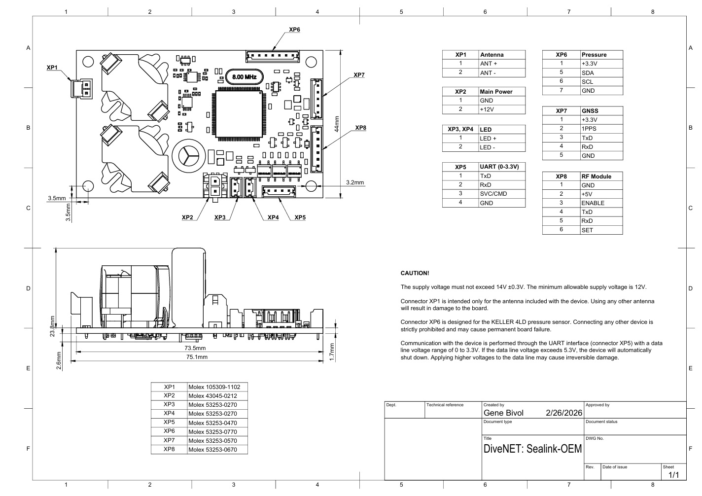

# DiveNET: Sealink-OEM Pinout & Interface

**Board**: DiveNET Sealink-OEM v1.0  
**Dimensions**: 73.5 mm × 44 mm  
**Power**: +12 V nominal (12 V min – 14 V ±0.3 V max) on XP2  
**UART**: 9600 8N1 (9600 baud, 8 data bits, no parity, 1 stop bit)  
**Caution**: UART lines (XP5) are 0–3.3 V logic only. Higher voltages (>5.3 V) will cause shutdown or permanent damage.

## Connector Overview

| Connector | Type                     | Purpose                          | Molex Part Number    |
|-----------|--------------------------|----------------------------------|----------------------|
| XP1       | Antenna                  | Acoustic transducer / antenna    | 105309-1102          |
| XP2       | Main Power               | +12 V input                      | 43045-0212           |
| XP3, XP4  | LED                      | Status LED output                | 53253-0270           |
| XP5       | UART (0–3.3 V)           | Serial control & data            | 53253-0470           |
| XP6       | External Pressure Sensor | I²C sensor interface             | 53253-0570           |
| XP7       | GNSS Module              | Positioning / timing             | 53253-0570           |
| XP8       | RF Module                | Radio / extended comms           | 53253-0670           |

## Detailed Pinouts

### XP1 – Antenna / Transducer
| Pin | Signal     | Description                  |
|-----|------------|------------------------------|
| 1   | ANT +      | Transducer positive          |
| 2   | ANT -      | Transducer negative          |

**Note**: Use only the supplied transducer/antenna. Other types may damage the board.

### XP2 – Main Power
| Pin | Signal     | Description                  |
|-----|------------|------------------------------|
| 1   | GND        | Ground                       |
| 2   | +12V       | Power input (12–14 V)        |

### XP3 & XP4 – LED
| Pin | Signal     | Description                  |
|-----|------------|------------------------------|
| 1   | LED+       | LED positive                 |
| 2   | LED-       | LED negative                 |

### XP5 – UART (0–3.3 V)
| Pin | Signal     | Direction | Description                          |
|-----|------------|-----------|--------------------------------------|
| 1   | TxD        | Output    | Modem → Host data                    |
| 2   | RxD        | Input     | Host → Modem data                    |
| 3   | SVC/CMD    | Output    | Strobe pulses (Tx start & Rx detect) |
| 4   | GND        | -         | Ground                               |

**Note**: SVC/CMD pin outputs short TTL pulses in firmware for external ToF timestamping.

### XP6 – External Pressure Sensor (I²C)
| Pin | Signal     | Direction | Description                          |
|-----|------------|-----------|--------------------------------------|
| 1   | +3.3V      | Output    | 3.3 V supply                         |
| 5   | SDA        | Bidirectional | I²C data line                    |
| 6   | SCL        | Output    | I²C clock                            |
| 7   | GND        | -         | Ground                               |

**Note**: Designed for KELLER 4LD pressure/temperature sensor only.

### XP7 – GNSS Module
| Pin | Signal     | Direction | Description                          |
|-----|------------|-----------|--------------------------------------|
| 1   | +3.3V      | Output    | 3.3 V supply                         |
| 2   | 1PPS       | Output    | 1 Pulse Per Second timing signal     |
| 3   | TxD        | Output    | GNSS data to host                    |
| 4   | RxD        | Input     | Host data to GNSS                    |
| 5   | GND        | -         | Ground                               |

### XP8 – RF Module
| Pin | Signal     | Direction | Description                          |
|-----|------------|-----------|--------------------------------------|
| 1   | GND        | -         | Ground                               |
| 2   | +5V        | Output    | 5 V supply                           |
| 3   | TxENABLE   | Input     | RF transmit enable                   |
| 4   | TxD        | Output    | Data to RF module                    |
| 5   | RxD        | Input     | Data from RF module                  |
| 6   | SET        | -         | Configuration / mode select          |

## Additional Notes
- All UART communication uses 9600 8N1.
- The modem operates in Command Mode by default.
- External pressure sensor (XP6) reports both pressure and temperature if supported.
- For independent ToF, use SVC/CMD strobe on XP5 Pin 3 with external timestamp capture.

___

___

© 2026 DiveNET Subsea Wireless – Beringia Enterprises LLC  
All rights reserved.
